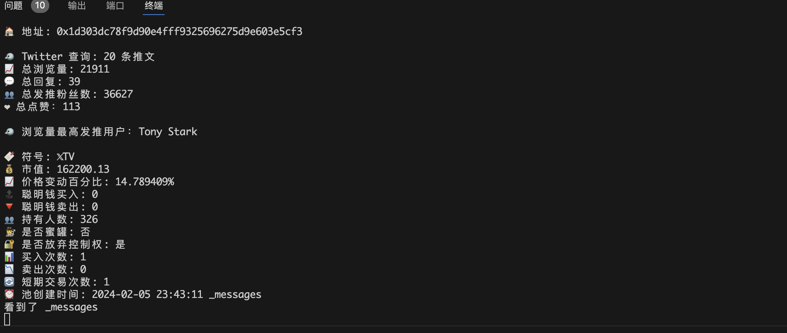
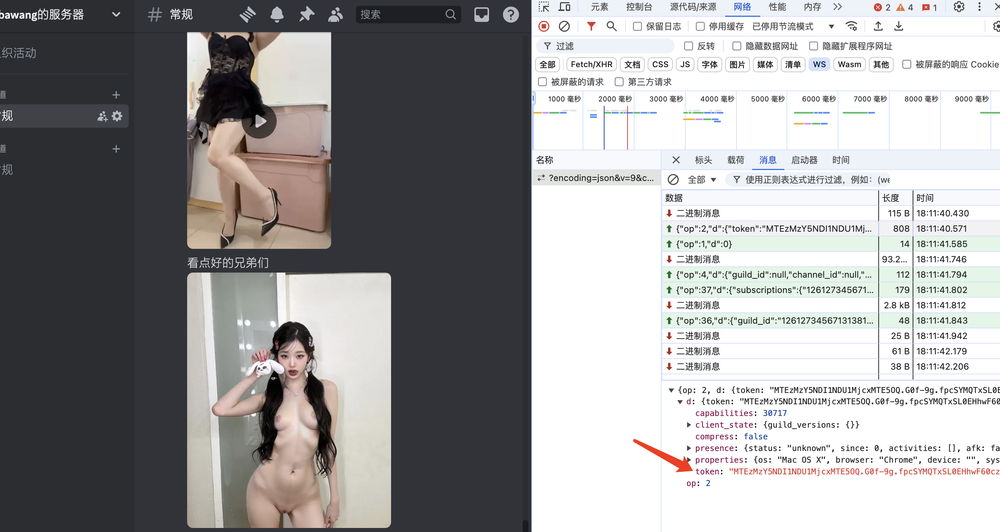
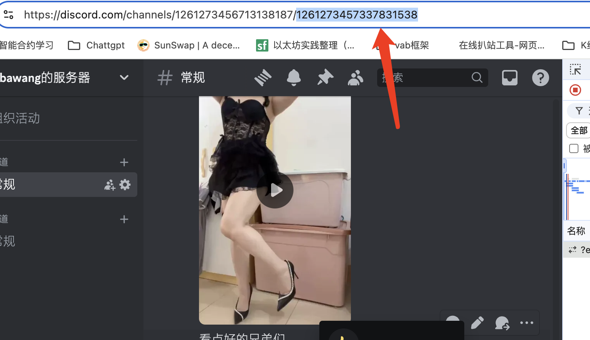
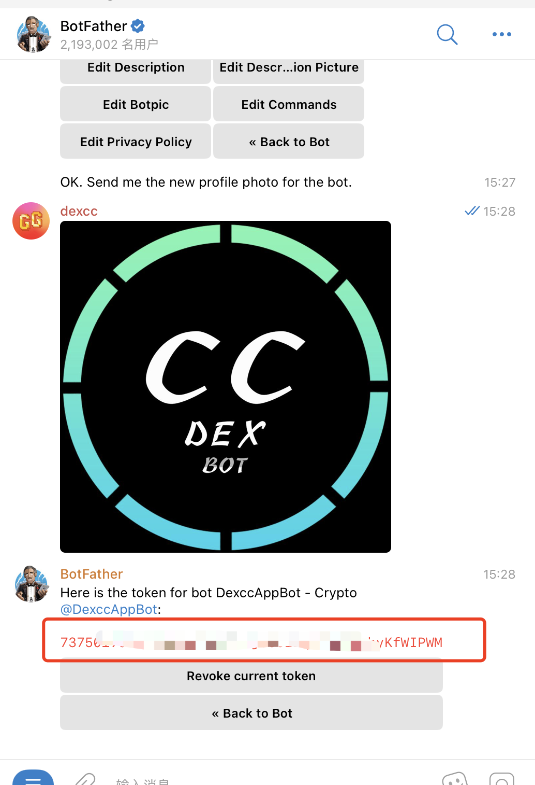

# Discord Tool

# Example

<p align="center"></p>

## Docs

一个根据 Discord API 开发的项目，用于实现 Discord 机器人功能，包括消息发送、频道管理、用户管理等。

## Functions

- 消息发送：发送文本、图片、语音、视频等消息到指定频道。
- 频道管理：创建、删除、修改频道，设置频道权限等。
- 用户管理：获取用户信息，封禁、解封用户等。
- 机器人管理：获取机器人信息，设置机器人状态等。
- 根据 Discord 频道监听转发至电报机器人
- 持续更新

## 安装

1. 克隆项目到本地

```bash
git clone https://github.com/HarryYe66/Discord-Tool.git

yarn instll
npm install
```

2. 配置环境变量

在 `.config/instances.ts` 文件中配置以下环境变量：

- `token` :Discord 账号的 ws 获取
- `DISCORD_TOKEN`：Discord 机器人的 Token。
- `TELEGRAM_TOKEN`：Telegram 机器人的 Token。
- `TELEGRAM_CHAT_ID`：Telegram 机器人的 Chat ID。

3. `.config/instances.ts` 配置教程

   - connectParams 通过登录网页版获取 token
   - 2 修改 token

   ```bash
        name: 'Instance1',
        connectParams: {
            token:"将token粘贴在这里",
        },
        bindings: [
   ```

- 3 修改 监听转发的地方

```bash
   bindings: [
   {
     discordChannelId: '1261273457337831538', //Discord的频道ID
     telegramBotToken: process.env.TELEGRAM_BOT_TOKEN_1 || '' //通过电报机器人获取的机器人私钥,
     telegramChatId: 'Dexcc_App'//需要转发分享的群聊或者你的电报账号 ,
   },
```

## How to config

`token` You can go to [Discord Developer Portal](https://discord.com/developers/applications) to create a new application and get the channel ID.

`discordChannelId` You can go to [Discord Developer Portal](https://discord.com/developers/applications) to create a new application and get the channel ID.

`telegramBotToken` You can go to [BotFather](https://t.me/BotFather) to create a new bot and get the token.

`telegramChatId` You can go to [Telegram](https://t.me/) to get the chat ID.

## You can see thitis project in my blog

   <p align="center"></p>
   <p align="center"></p>
   <p align="center"></p>
   <p align="center"></p>
<p align="center"></p>
